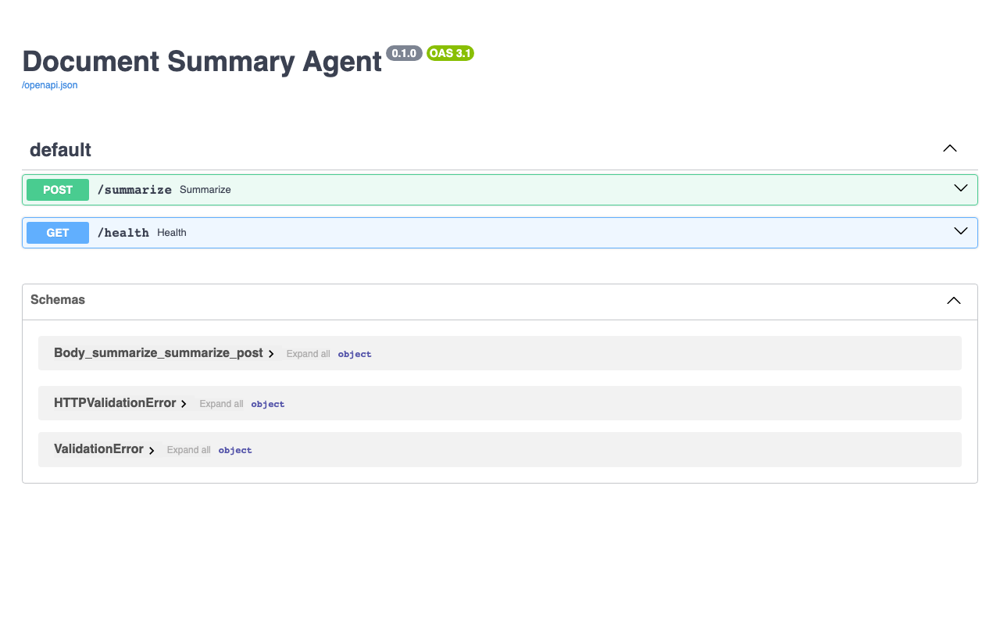

# Document Summary Agent



A lightweight REST API that summarizes documents using a local LLM via Ollama. Upload a PDF, DOCX, or plain text file and get back a concise summary - no cloud APIs, no data leaving your machine.

## What it does

POST a document to `/summarize` and the agent extracts the text, trims it to a manageable size, and sends it to your locally running Ollama instance. The response is a short, readable summary of the key points.

Supported file types: `.pdf`, `.docx`, `.txt`, and most other plain-text formats.

## Prerequisites

- Python 3.10+
- [Ollama](https://ollama.com) running locally with `llama3.2` pulled

```bash
ollama pull llama3.2
ollama serve
```

## Setup

```bash
pip install -r requirements.txt
uvicorn main:app --reload
```

The API will be available at `http://localhost:8000`. Interactive docs at `http://localhost:8000/docs`.

## Usage

```bash
# Summarize a PDF
curl -X POST http://localhost:8000/summarize \
  -F "file=@report.pdf"

# Summarize a plain text file
curl -X POST http://localhost:8000/summarize \
  -F "file=@notes.txt"
```

Example response:

```json
{
  "filename": "report.pdf",
  "summary": "The report covers Q3 financial results, highlighting a 12% revenue increase..."
}
```

## Endpoints

| Method | Path | Description |
|--------|------|-------------|
| `POST` | `/summarize` | Upload a document and get a summary |
| `GET` | `/health` | Check if the server and Ollama are reachable |

## Configuration

Edit the constants at the top of `main.py` to change the Ollama host or model:

```python
OLLAMA_BASE_URL = "http://localhost:11434"
OLLAMA_MODEL = "llama3.2"
```

Any model available in Ollama will work - swap in `mistral`, `phi3`, or anything else you have pulled.
